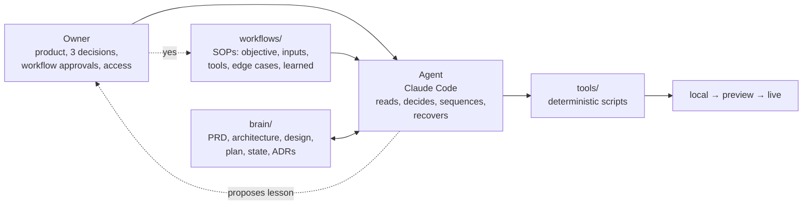

# claude-code-wat-kit

**One file turns an empty folder into a governed Claude Code project.** Drop `CLAUDE.md` in, type `go`, and Claude Code unpacks a complete operating system for building an app: a project memory, step-by-step workflows, deterministic tools, safety guards, pixel-level visual QA, and a self-improvement loop where every lesson is proposed to you before it changes the process.

Built for people who know how software gets delivered but have never written it: project and delivery managers, analysts, solution architects on the non-coding side, founders from IT. You bring the product, three decisions and the logins. Claude Code does the engineering, inside rails it cannot quietly step over.

> Status: **v0.9 beta.** The installer, guards and tools are tested in CI. A few Claude Code integration points are verified against the docs but not yet across many real projects. See [docs/VERIFICATION.md](docs/VERIFICATION.md). Not affiliated with Anthropic.

---

## Start in 60 seconds

Requirements: [Claude Code](https://code.claude.com), Node 20+, git, a GitHub account. A Claude Max plan is assumed for the model defaults.

```bash
mkdir my-app && cd my-app
curl -fsSLo CLAUDE.md https://raw.githubusercontent.com/amrishmudgal/claude-code-wat-kit/main/dist/CLAUDE.md
claude
```

Then type:

```
go
```

Claude writes a small extractor from the file, runs it, and the 130 KB installer replaces itself with a CLAUDE.md of under 50 lines plus 60-odd project files. It checks your machine, creates a private GitHub repo, installs the browser tooling, and asks you to restart. The next `go` starts discovery: a short interview that becomes your PRD.

The full owner's guide is [kit/PLAYBOOK.md](kit/PLAYBOOK.md). It is also copied into every project.

---

## Why this exists

People who do not code hit the same three failures when building with an AI agent:

1. **It forgets.** Decisions made on Monday are rebuilt differently on Thursday.
2. **Scope creeps.** The project grows past the idea and never ships.
3. **Something broken or unsafe goes live**, because nobody was reading the code.

Anyone from delivery already knows the cure: written scope, a repeatable process, gates before release, a decision log. This kit gives the agent exactly those and enforces them with scripts and hooks instead of good intentions.

## The WAT model

AI reasoning is probabilistic. Code is deterministic. If each hand-done step is 90% reliable, five in a row succeed about 59% of the time. So the agent reasons, and anything that must come out the same every time is pushed into a script.



| Layer | Where | Job |
|---|---|---|
| **W**orkflows | `workflows/*.md` | Standing instructions for each kind of work: discovery, stack selection, design-first, build task, debug, security review, release, add a service, session hygiene, visual QA. |
| **A**gent | Claude Code | Reads the workflow, runs tools in order, handles failures, keeps the state file current. |
| **T**ools | `tools/*.mjs` | Exact jobs done the same way every time: checks, secret scan, env audit and push, visual diff, command guard, session hooks. |

**Order of work, always:** understand → research → clarify product questions → plan → build → env setup → test locally → deploy → verify live.

**Self-improvement loop:** read the full error → fix → verify → record the lesson as a *proposed* workflow change → you approve → it is applied. Workflows never change behind your back. That is enforced twice: edits under `workflows/` are on Claude Code's ask list, and the guard blocks shell writes to that folder.

---

## Who does what

| Claude does, without asking | You are asked only for |
|---|---|
| All code, terminal, git branches, PRs and merges | **Access:** sign-ups, logins, API keys, DNS, a card. Click-by-click steps, never pasted in chat |
| Database schema, migrations, RLS | **Three decisions:** the PRD, the architecture-and-cost summary, the design direction |
| Hosting config, env vars, deploys, rollbacks | **Workflow changes:** before/after plus reason, batched at the end of a task |
| Tests, browser verification, visual QA, security audit | **Scope or money:** anything outside the PRD, anything that starts costing |
| Stack choice, researched against current docs and prices, with ADRs | |

You are never asked to pick a library, read code, run a procedure, or send a screenshot.

## What gets installed

```
CLAUDE.md                 < 50 lines. The loop and the rules. Loaded every session.
brain/                    00_INDEX 01_PRD 02_ARCHITECTURE 03_DESIGN 04_PLAN 05_STATE
                          06_DECISIONS 07_SECURITY 08_TEST_PLAN 09_RUNBOOK phases/
workflows/                README (the WAT model) · _TEMPLATE · 00_bootstrap … 10_visual-qa
tools/                    preflight · check · secret-scan · env-check · env-push · visual-diff
                          guard · session-brief · stop-check · notify-slack
.claude/
  settings.json           permissions (allow / ask / deny), hooks, plugins, 200k context cap
  commands/               /start /build /plan-phase /debug /review /ship /handoff /status
  agents/                 researcher · reviewer · security-auditor (separate context, cheaper model)
  rules/                  frontend · backend-data · testing · trigger-dev (path-scoped, load on demand)
  skills/frontend-design/
design/                   brand_assets/ mockups/ baselines/ visual.json
.github/                  ci.yml · dependabot.yml
.mcp.json                 chrome-devtools
.env.example              names only, never values
```

## The rails

| Risk | What stops it |
|---|---|
| New session knows nothing | `SessionStart` hook prints `brain/05_STATE.md` into every new, cleared or compacted session |
| State file goes stale | `Stop` hook refuses to end a turn while project files are newer than the state file |
| Context bloat | Same hook warns near 120k tokens and makes Claude wrap up; hard cap at 200k |
| Force push, push to `main`, `--admin` merge, `vercel --prod`, cloud DB reset | `tools/guard.mjs` (PreToolUse) exits 2 with the correct alternative |
| Secrets in chat, logs or git | Env files are deny-listed for reading; `env-check` reports names only; `env-push` pipes values to the host unseen; `secret-scan` runs in every check and in CI |
| UI drifting from the design | `visual-diff`: Playwright renders the HTML mockup and the live screen at 375 and 1440 px, pixelmatch compares. 3% against the design, 0.2% against approved baselines. Numbers come back, not images |
| Same bug "fixed" twice | Two failed fixes end the session; the next starts clean from written evidence |
| Invented APIs | Research step before planning and before first use of any outside API |
| Process changing unnoticed | Ask-rule on `workflows/**` plus guard block plus proposals parked in the state file |
| Bad release | Phase branch → PR → CI → preview verified in a real browser → merge → production smoke test → automatic rollback on failure |

## The phases

0 Bootstrap → 1 Discovery (PRD) → 2 Stack (architecture + cost) → 3 Design (HTML mockups, tokens) → 4 Foundation (live URL, auth, empty home matching the design) → 5+ Feature slices, one vertical flow each → Hardening → Launch.

Default service menu, all operable from a CLI: GitHub, Supabase, Vercel, Resend, Trigger.dev or Modal for long jobs, Sentry, Slack webhook. The agent may choose differently and must write the ADR and swap path when it does.

---

## Customise and rebuild

Everything the installer ships lives in [`kit/`](kit). Edit there, never in `dist/`.

```bash
npm test          # lint the kit, test every guard rule, prove the installer round-trips (LF, CRLF, truncated)
npm run build     # repack kit/ into dist/CLAUDE.md
```

No dependencies are needed for either. Common changes: your own default stack in `kit/workflows/02_stack-selection.md`, house rules in `kit/.claude/rules/`, extra guard patterns in `kit/tools/guard.mjs` (add a test case), your own workflows from `kit/workflows/_TEMPLATE.md`.

Design notes are in [docs/ARCHITECTURE.md](docs/ARCHITECTURE.md).

## FAQ

**Why one file instead of a template repo?** A template repo needs git knowledge before the first step. A single file needs a folder and the word `go`. It also means the agent, not the owner, performs the setup, which is the habit the whole kit depends on.

**Does it work on an existing project?** Not yet. The installer expects an empty folder. Brownfield adoption is on the roadmap.

**Does it need a Max plan?** No, but the defaults assume one: Opus as the main model, Sonnet for subagents. On API billing, change the models in `.claude/agents/*.md` and expect real per-token cost.

**Is the stack fixed?** No. The kit is stack-agnostic. Path-scoped rule files load only when matching files are touched.

**Can the owner see the UI for review?** Yes, at the localhost or preview URL Claude reports. They are just never the test.

## Roadmap

- Brownfield install into an existing repo
- Upgrade command: move a project from kit vN to vN+1 without touching `brain/`
- More path-scoped rule packs for common job platforms and frameworks
- A second visual-QA reference type: Figma frame exports

## Contributing

Issues and PRs welcome. Read [CONTRIBUTING.md](CONTRIBUTING.md). Security reports: [SECURITY.md](SECURITY.md).

## License

[MIT](LICENSE). "Claude" and "Claude Code" are trademarks of Anthropic. This project is independent and not endorsed by Anthropic.
